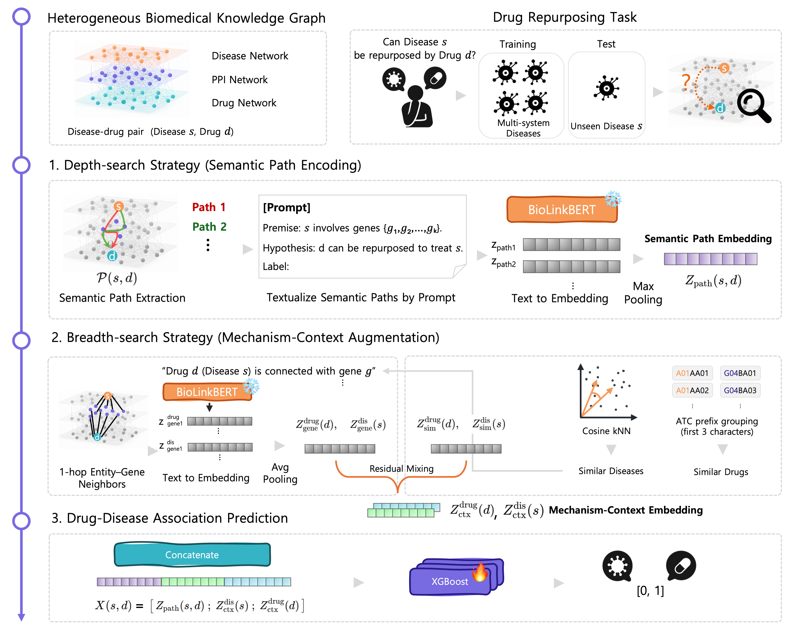

# CAREPath

**CAREPath (Context-Aware REasoning Path)** is a KG–LLM framework for **drug repurposing** that predicts disease–drug associations by combining:
- **Depth-search strategy** — constrained semantic path encoding over short disease–gene–drug paths  
- **Breadth-search strategy** — mechanism context augmentation from 1-hop gene neighborhoods  

> Note: *depth-search* and *breadth-search* are used as analogies to depth-first and breadth-first exploration, not as literal DFS/BFS traversal algorithms.

It fuses these two complementary signals and scores pairs using an **XGBoost-based stacking ensemble**.

Across five biomedical knowledge graphs (MSI, PrimeKG, Hetionet, SuppKG, KEGG50k) and 18 baselines, CAREPath achieves the best overall **AUPRC**, including under the disease cold-start setting, with gains of up to **3.6%**.

This repository includes code to:
1) **Extract per-pair embeddings** (semantic path + mechanism context)  
2) **Run prediction and evaluation** (CV with random/drug/disease splits)

---

## What CAREPath does (high-level)



Given a disease–drug pair *(s, d)*:

### 1) Constrained semantic path encoding (depth-search strategy)
- Enumerate short simple paths **s → gene(s) → d** with constraints (max hop=3, limited number of intermediate genes `k_max`).
- We set `k_max = 2` based on a coverage–redundancy trade-off analysis across BKGs.
- Convert each path into an NLI-style prompt:
  - `Premise: {disease} involves genes {g1, ..., gk}.`
  - `Hypothesis: {drug} can be repurposed to treat {disease}.`
  - `Label:`
- Encode each prompt with **BioLinkBERT (CLS)** and aggregate via **max pooling** to obtain a pair-specific semantic path embedding **Z_path(s,d)**.
- If no path exists even after ATC-based drug substitution, use a fallback prompt with the premise phrased as `s involves no associated genes.` (a rare case; e.g., 7 of 1,661 drugs and none of the 840 diseases in MSI).

### 2) Mechanism context augmentation (breadth-search strategy)
- Build entity-level context from **1-hop gene/protein neighbors only** (to reduce direct disease–drug leakage).
- Encode neighborhood sentences with BioLinkBERT and mean-pool into initial context embeddings.
- Apply similarity-guided pooling + residual mixing (with mixing weights α for diseases and β for drugs):
  - **Drugs:** pool within ATC-prefix–related drugs
  - **Diseases:** pool via gene-signature similarity (cosine kNN on weighted gene vectors)
- When the neighbor set is empty, the residual mixing is defined piecewise so that the entity's own gene-neighborhood embedding is retained rather than shrunk by mixing with a zero vector.
- Produces robust context embeddings **Z_ctx^drug(d)** and **Z_ctx^dis(s)**, especially when paths are sparse/noisy.

### 3) Feature fusion + prediction
- Concatenate features:
  - `Z_path(s,d)`, `Z_ctx^dis(s)`, `Z_ctx^drug(d)`
- Score with an **XGBoost stacking ensemble** for final association probability.

---

## Setup
```bash
pip install -r requirements.txt
```

BioLinkBERT (`michiyasunaga/BioLinkBERT-base`) is downloaded automatically from Hugging Face on first run. To use a custom cache location, set the `BIOLINKBERT_CACHE_DIR` environment variable.

---

## Usage

> The examples below use the **MSI** knowledge graph. The same pipeline applies to the other four BKGs (PrimeKG, Hetionet, SuppKG, KEGG50k) once each is preprocessed into the same `graph.txt` / `nodetypes.tsv` / `dda_labels.tsv` format.

---

## Datasets

All five knowledge graphs used in this study are publicly available from their original sources. Due to their respective licenses, **we do not redistribute the datasets (raw or processed) in this repository**; please obtain them directly from the links below.

| Knowledge graph | Source | Reference |
|---|---|---|
| **MSI** | https://github.com/snap-stanford/multiscale-interactome | Ruiz et al., *Nat Commun* 2021 |
| **PrimeKG** | https://github.com/mims-harvard/PrimeKG | Chandak et al., *Sci Data* 2023 |
| **Hetionet** | https://github.com/hetio/hetionet | Himmelstein et al., *eLife* 2017 |
| **SuppKG** | https://github.com/biothings/SuppKG | Schutte et al., *J Biomed Inform* 2022 |
| **KEGG50k** | https://figshare.com/s/bbfc7b82d17e0b8b6a43 | Kanehisa et al., *Nucleic Acids Res* 2017 |

Each KG must be preprocessed into the common format used by CAREPath:
- `graph.txt` — edge list of the unified interaction graph
- `nodetypes.tsv` — node type annotations (drug / disease / gene)
- `dda_labels.tsv` — labeled drug–disease pairs (positives + sampled negatives)
- `7_drug_classification_df.tsv` — ATC drug classes (for drug context pooling)

Preprocessing scripts are provided in `scripts/`. The MSI pipeline (`scripts/preprocess.py`) is documented below as a worked example; the other four KGs follow the same target format.

---

### MSI (worked example)

We use the Multiscale Interactome (MSI) resources provided by the official repository:
https://github.com/snap-stanford/multiscale-interactome

We download MSI supplementary datasets **#1–#7**:
- **#1–#5** (interaction datasets) → filtered to retain only drugs, diseases, genes/proteins, and biological functions (GO terms), and restricted to five relation types (drug–gene, disease–gene, gene–gene, gene–biological function, biological function–biological function); the resulting subgraph contains **41,941 nodes and 478,728 edges** → `graph.txt`, `nodetypes.tsv`
- **#6** (approved drug–disease pairs) → positive label set, converted into `dda_labels.tsv` and augmented with **random negative sampling at 1:1 ratio**
- **#7** (ATC drug classes) → ATC-prefix–based drug context pooling → `7_drug_classification_df.tsv`

> The preprocessing step keeps the extracted MSI files under `data/raw/msi/extracted/`. The embedding step reads these raw files to map node IDs to human-readable drug/disease/gene names, so do not delete that folder after preprocessing.

---

### PrimeKG

Downloaded from the official repository:
https://github.com/mims-harvard/PrimeKG

Starting from the original PrimeKG release, filter the graph to retain only node types relevant to our setting: **genes/proteins, drugs, diseases, biological process, anatomy, molecular function, cellular component, and pathway**. The processed graph contains **88,357 nodes and 1,340,022 edges** → `graph.txt`, `nodetypes.tsv`. Extract indication edges as positive drug–disease pairs and sample negatives at **1:1 ratio** → `dda_labels.tsv`. Parse ATC codes from PrimeKG drug features → `7_drug_classification_df.tsv`.

---

### Hetionet

Downloaded from the official repository:
https://github.com/hetio/hetionet

Download the original Hetionet release and filter it to match our entity scope by **retaining only drug, disease, and gene nodes and removing all other node and relation types**. Extract drug–disease association edges to construct the labeled prediction dataset. The resulting Hetionet subgraph contains **19,918 nodes and 1,114,451 edges** → `graph.txt`, `nodetypes.tsv`. Positive drug–disease labels come from Compound–treats–Disease edges; sample negatives at **1:1 ratio** → `dda_labels.tsv`. Join drug (DrugBank) IDs with the DrugBank ATC table → `7_drug_classification_df.tsv`.

---

### SuppKG

Downloaded from the official repository:
https://github.com/biothings/SuppKG

SuppKG is a literature-derived knowledge graph constructed from PubMed abstracts using an extended SemRep pipeline enriched with supplement-specific terminology, with additional relation filtering to improve precision. Entities in SuppKG are annotated with **UMLS semantic type (semtype) codes**.

To align SuppKG with our mechanistic setting, construct a task-aligned subgraph by retaining only drug-, disease-, and gene/protein-related concepts based on the following selected semtypes:
- `phsu`, `orch` → **drug**
- `dsyn` → **disease**
- `gngm`, `aapp`, `enzy` → **gene/protein**

Then filter edges to keep only those whose both endpoints belong to the retained node sets, yielding a DDG-only subgraph. This filtered SuppKG subgraph contains **26,615 nodes and 147,038 edges** → `graph.txt`, `nodetypes.tsv`. Extract labeled drug–disease pairs and sample negatives at **1:1 ratio** → `dda_labels.tsv` (split with stratified sampling at 8:1:1). 

---

### KEGG50k

Downloaded from:
https://figshare.com/s/bbfc7b82d17e0b8b6a43

KEGG50k is a ready-to-download benchmark biomedical knowledge graph derived from KEGG, originally curated to support drug–target interaction prediction while preserving pathway-structured biological context (e.g., drug–target, disease–gene, and pathway–gene links). Download the KEGG50k release and use it **as provided**. The processed KEGG50k graph contains **16,201 nodes and 63,080 edges** → `graph.txt`, `nodetypes.tsv`. Extract labeled drug–disease association pairs and sample negatives at **1:1 ratio** → `dda_labels.tsv`. Parse ATC codes from KEGG DRUG entries (`ATC code` field) → `7_drug_classification_df.tsv`.

---

### Summary of preprocessed KG statistics

| Dataset | # Nodes | # Edges | # Labeled pairs (Train / Val / Test) |
|---|---:|---:|---:|
| MSI      | 41,941 | 478,728    | 9,488 / 1,186 / 1,186 |
| PrimeKG  | 88,357 | 1,340,022  | 11,938 / 1,492 / 1,492 |
| Hetionet | 19,918 | 1,114,451  | 1,194 / 149 / 149 |
| SuppKG   | 26,615 | 147,038    | 33,360 / 4,170 / 4,170 |
| KEGG50k  | 16,201 | 63,080     | 8,988 / 1,124 / 1,124 |

**Split protocol.** All labeled pairs are split 8:1:1 using `GroupShuffleSplit` grouped by disease. The 10% test partition is set aside before any hyperparameter search or model fitting. Negatives are sampled **once** before any split and are fixed thereafter, so no entity crosses a partition boundary.

---

## 0) Preprocess data
This step generates:
- `dataset/graph.txt`
- `dataset/nodetypes.tsv`
- `dataset/dda_labels.tsv`
- `dataset/7_drug_classification_df.tsv` (ATC drug classes)

```md
# Download MSI data.tar.gz and preprocess
python scripts/preprocess.py \
  --download \
  --out_dir "dataset" \
  --neg_ratio 1.0 \
  --seed 42
```

If you already have data.tar.gz, place it under data/raw/msi/data.tar.gz and run:
```md
python scripts/preprocess.py \
  --out_dir "dataset" \
  --neg_ratio 1.0 \
  --seed 42
```

## 1) Extract embeddings
This step creates a per-pair embedding dictionary (`.pkl`) keyed by `"{disease}__{drug}"`.
Passing `--dataset_dir` lets the script locate all dataset files (`graph.txt`, `nodetypes.tsv`, `dda_labels.tsv`, and the ATC file) automatically.

### Example
```md
python -m extract_embeddings.main \
  --dataset_dir "dataset" \
  --output_file "outputs/embeddings.pkl" \
  --seed 42 \
  --max_genes 2 \
  --workers 5 \
  --run_id 0
```

You can also point to each file explicitly instead of `--dataset_dir`:
```md
python -m extract_embeddings.main \
  --network_file "dataset/graph.txt" \
  --node_type_file "dataset/nodetypes.tsv" \
  --pair_file "dataset/dda_labels.tsv" \
  --atc_file "dataset/7_drug_classification_df.tsv" \
  --output_file "outputs/embeddings.pkl" \
  --seed 42 \
  --max_genes 2 \
  --workers 5 \
  --run_id 0
```

## 2) Train and Prediction
```md
mkdir -p outputs
python -m prediction.train_and_prediction \
  --embedding_file "outputs/embeddings_seed42.pkl" \
  --pair_file "dataset/dda_labels.tsv" \
  --seed 42 \
  --n_splits 5 \
  --splits "random,drug,disease" \
  --output_file "outputs/cv_results.tsv" \
  --pred_detail_file "outputs/cv_pred_details.tsv"
```
